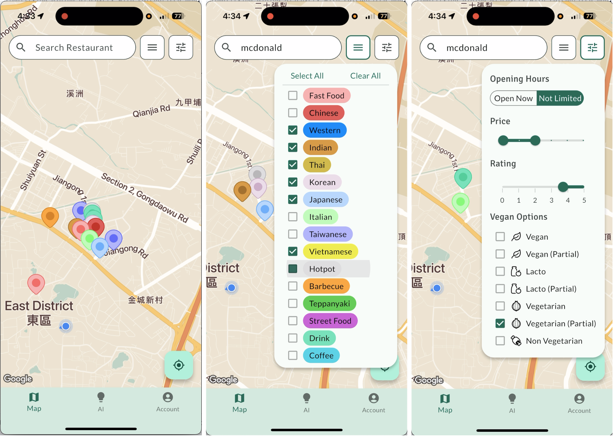
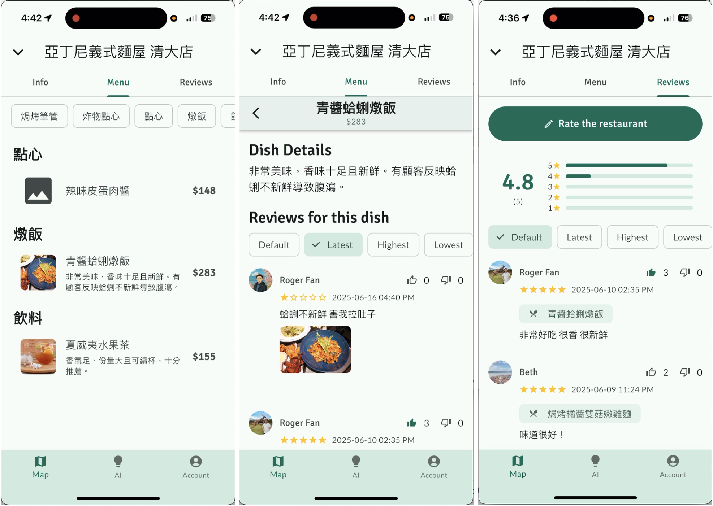
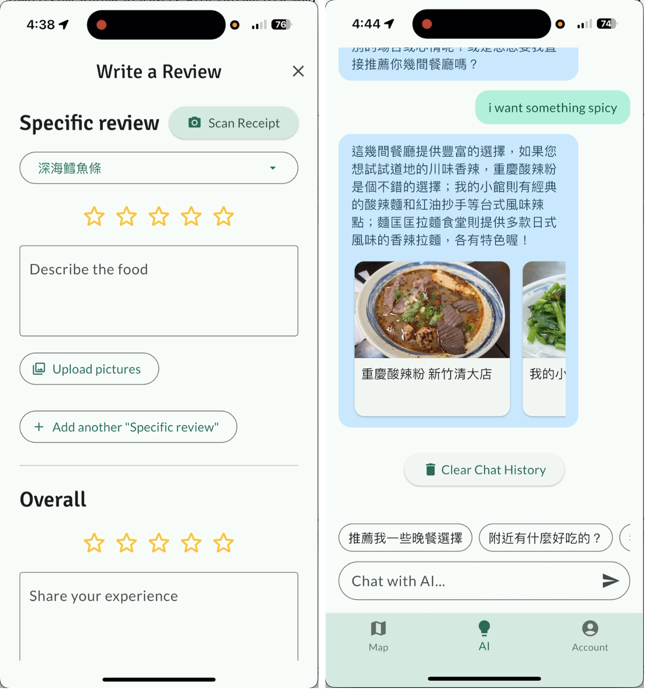
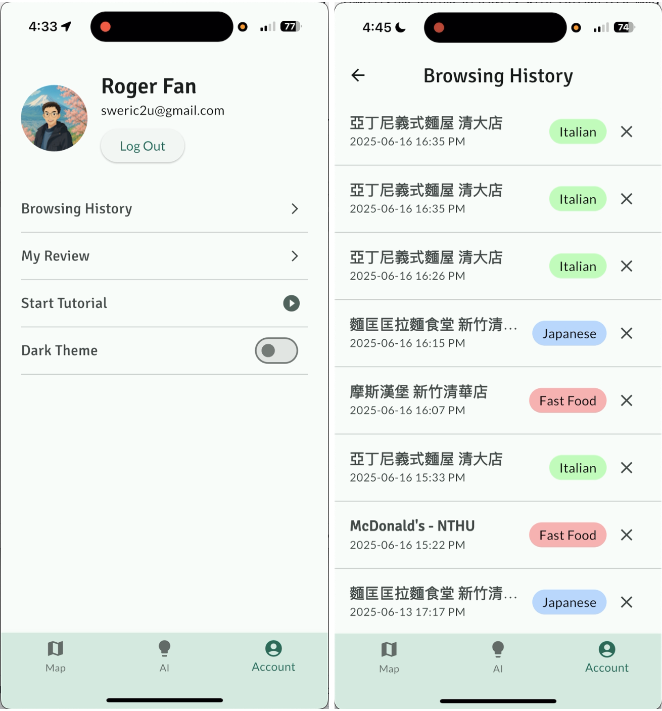
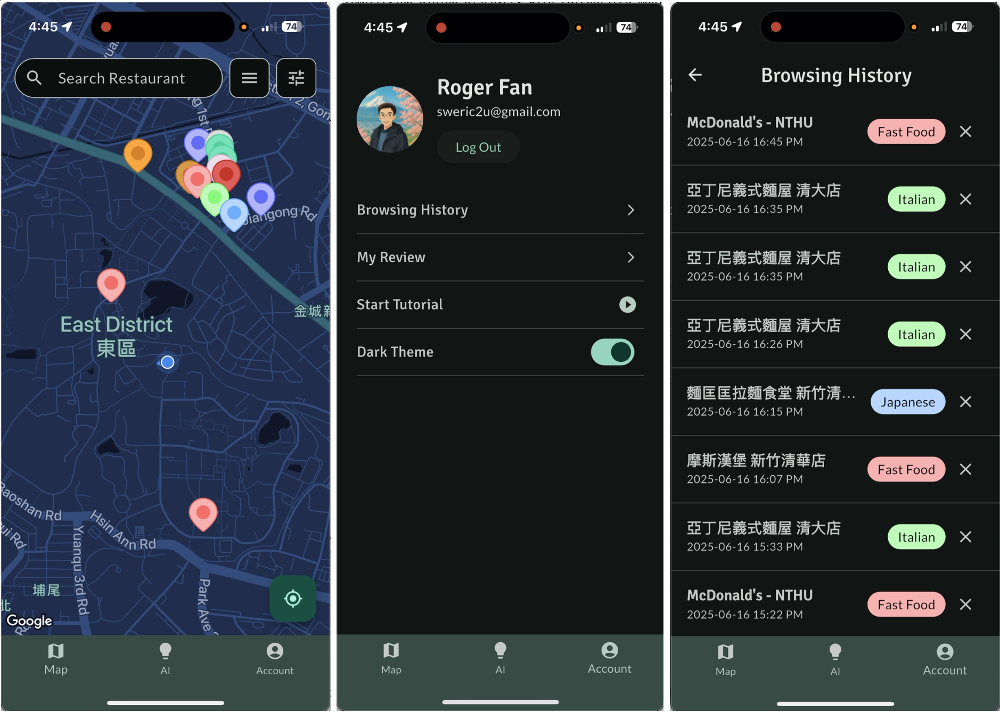

<h3>Sophomore (2025 Spring) Software Design & Studio</h3>

# Final Project - Foodie
- a app aimed at simplifying dining discovery with categorized map, clear menus and powerful AI
- languages used: Dart, TypeScript
- tools used: **Flutter**, Google Maps API, **Firebase**, **Vertex AI**, Gemini API
- [Demo Video](https://www.youtube.com/watch?v=pChefdugAvM)

## 📑 Project Details
### AI Chat:
- Engage in a conversation with the AI. It can:
  - **Continue the conversation** if the user's question is **not clear enough** or the description is insufficient. 
  - **Recommend 1-3 suitable restaurants** when it determines a result has been reached. The restaurant cards can link to the map. 
- An AI summary for a specific dish will be triggered whenever a review for that dish is added, deleted, or edited. 
- An AI summary for the entire restaurant will be triggered whenever an overall restaurant review is added, deleted, or edited. 
- Use **receipt scanning** to identify consumed dishes and **automatically populate them on the review page to facilitate writing dish-specific reviews**. 
### Special/Key Features: 
- Search for restaurant names/filter by restaurant category/filter by vegetarian options. 
- Navigate to Google Maps for directions. 
- On the menu page, use "category tags" to jump to corresponding dish categories. 
- Click on a dish to display its specific reviews, which can be sorted by "Most Popular, Newest, Highest, Lowest". 
- Logged-in users can "write, edit, delete, like, dislike" reviews; a prompt will appear for non-logged-in users. 
- Review writing page: select pictures from the album, select dishes from the menu, scan a receipt to fill in dishes. 
- Click on images to view them in a larger format. 
- Tutorial feature -> spotlight carousel showcase. 
- Google Login. 
### Aesthetic Design: 
- Two non-default Google Map API themes (light/dark) that match the app's primary colors. 
- **Custom Google Map API icons** <- using SVG as a template to replace a custom token with the restaurant's color. 
### Technical Details: 
- Frontend: Google Map API, Google Login, Geolocation, Image Upload, Image Zoom, Spotlight Carousel. 
- Backend: Genkit AI, Cloud Function, Firebase Storage, Firestore database.

## 🤖 AI Flow Architecture
### Summary Generation After Review Changes 
- An onDocumentWrite event triggers a Cloud Function upon creation, update, or deletion. 
- Summary generation is divided into two phases: initial generation and a verification phase. 
- `Process:` The original prompt would generate subjective wording. This was significantly improved by adding a second verification AI. 

### Restaurant Recommendation Function 
- The AI will automatically generate questions or recommend restaurants based on the user's Browse history, available restaurants and dishes, and conversation history. When the user's response is vague, the system will provide specific dishes as examples. 
- Supports dish-oriented recommendations: For example, if a user wants to eat beef noodles, the system will recommend restaurants that offer beef noodles, even if the restaurant's name is unrelated to the dish. 
- In addition to recommending restaurants, the system will also provide brief introductions to help users make their final choice. 
- `Process:` Initially, the AI would endlessly ask questions and not recommend restaurants, even when the user's intent was clear. After adjustments, many rules were added to the prompt, such as directly providing recommendations when the user asks the AI to decide for them or has clearly stated the type of meal they want. 

### Receipt Recognition Function 
- Automatically select dishes for review using a photo of the receipt. 
- `Process:` First, OCR is used to extract text from the photo. Then, the extracted text is provided to the AI along with all dish names for matching. The corresponding dish IDs are returned for frontend processing.

## 📹 Project Deliverables
- Demo video with introduction: [YouTube Link](https://www.youtube.com/watch?v=pChefdugAvM)

- `Map page` screenshot

- `Menu page` and `Review page` screenshot

- `write review page` and `AI page` Screenshot

- `Account page` and `Browsing History page` Screenshot

- Darkmode Screenshot

## 🤝 Contributing
- 💡 brainstorming and drawing Figma by all of us
- Me(@rogerfan48): designing most of the frontend (Flutter), implementing app's features and tuning data architecture
- Sean(@SeanChang-3245): building fundation of data architecture and tuning AI prompt
- Beth(@BethTsai): designing a portion of the frontend and organizing restaurant data
- Jeffrey(@Jeffrey931129): designing some of the frontend and implementing some features
